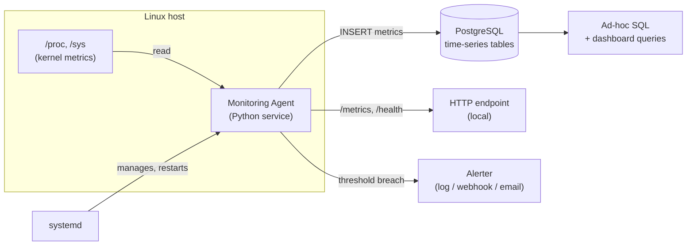

# Capstone 01 — Linux Monitoring Agent

> Build this after you're comfortable with the Python, SQL, and Linux fundamentals. It combines **Linux** (reading `/proc`, systemd, signals), **Python** (a long-running service, concurrency, packaging), and **SQL** (storing time-series metrics in PostgreSQL).

---

## 1. Project overview
A lightweight agent that runs on a Linux host, samples system metrics (CPU, memory, disk, load, network), stores them in PostgreSQL, exposes them over a small HTTP endpoint, and raises alerts when thresholds are breached. It's a miniature version of what the Prometheus `node_exporter` + a TSDB + Alertmanager do — built from scratch so you understand every layer.

## 2. Business problem
You can't operate what you can't see. Teams need to know when a server is running out of memory or disk *before* it takes the app down. Off-the-shelf tools exist, but understanding how an agent collects, stores, and alerts on metrics is core to DevOps/SRE work — and being able to build a focused agent (for an air-gapped box, an embedded device, or a custom metric) is a real, marketable skill.

## 3. Architecture



Data flow: a sampling loop reads `/proc` on an interval → normalizes into metric records → writes them to PostgreSQL in batches → a rules engine evaluates thresholds → breaches fire alerts. systemd keeps the agent alive and restarts it on failure.

## 4. Requirements

### Functional
- Collect at minimum: CPU utilization %, load average, memory used/available, swap, disk usage per mount, disk I/O, network bytes in/out, process count, agent uptime.
- Sample on a configurable interval (default 15s).
- Persist every sample to PostgreSQL with a timestamp and `hostname`.
- Evaluate configurable threshold rules (e.g., disk > 85%, mem > 90% for N consecutive samples) and emit alerts.
- Expose `GET /health` (liveness) and `GET /metrics` (latest snapshot, JSON and/or Prometheus text format).
- Provide a CLI: `agent run`, `agent once` (single sample to stdout), `agent initdb`.
- Configurable via a file (`config.toml`/`.env`) and environment variables.

### Non-functional
- Low overhead: < 1% CPU, small memory footprint; sampling must not block on DB writes.
- Resilient: survive transient DB outages (buffer and retry, never crash the sampler).
- Graceful shutdown on SIGTERM/SIGINT (flush buffer, close DB).
- Idempotent schema setup; safe to restart anytime.
- Observable: structured logs to stdout; its own internal counters.
- Portable across common distros (Ubuntu/Debian/RHEL); Python 3.12+.

## 5. Folder structure
```
linux-monitoring-agent/
├── pyproject.toml
├── README.md
├── config.example.toml
├── src/
│   └── agent/
│       ├── __init__.py
│       ├── __main__.py          # CLI entrypoint (argparse/typer)
│       ├── config.py            # load + validate config
│       ├── collectors/
│       │   ├── __init__.py
│       │   ├── cpu.py           # parse /proc/stat
│       │   ├── memory.py        # parse /proc/meminfo
│       │   ├── disk.py          # statvfs + /proc/diskstats
│       │   └── network.py       # /proc/net/dev
│       ├── storage.py           # PostgreSQL writer (batched, retrying)
│       ├── rules.py             # threshold evaluation
│       ├── alerter.py           # log/webhook/email sinks
│       ├── http_server.py       # /health, /metrics
│       └── runner.py            # the sampling loop + signal handling
├── sql/
│   ├── 001_schema.sql
│   └── 002_indexes.sql
├── deploy/
│   ├── agent.service            # systemd unit
│   └── Dockerfile
└── tests/
    ├── test_collectors.py       # parse known /proc fixtures
    ├── test_rules.py
    └── test_storage.py
```

## 6. Step-by-step implementation guide

1. **Schema first (SQL).** Design a metrics table. Start simple, normalize lightly:
   ```sql
   CREATE TABLE metrics (
       id         BIGSERIAL PRIMARY KEY,
       host       TEXT        NOT NULL,
       metric     TEXT        NOT NULL,         -- e.g. 'cpu.util', 'mem.used_pct'
       value      DOUBLE PRECISION NOT NULL,
       labels     JSONB       NOT NULL DEFAULT '{}',  -- e.g. {"mount":"/"}
       ts         TIMESTAMPTZ NOT NULL DEFAULT now()
   );
   CREATE INDEX idx_metrics_host_metric_ts ON metrics (host, metric, ts DESC);
   ```
   (Ties to SQL Lessons 07–09: types, constraints, indexes. Consider table partitioning by day for retention.)

2. **Collectors (Linux + Python).** Parse `/proc`:
   - CPU %: read `/proc/stat` twice with a delay; compute the delta of idle vs total jiffies.
   - Memory: parse `/proc/meminfo` (`MemTotal`, `MemAvailable`).
   - Disk usage: `os.statvfs(mount)`; disk I/O: `/proc/diskstats`.
   - Network: `/proc/net/dev` deltas for bytes in/out.
   Each collector returns a list of metric records. Pure functions over file contents → trivially testable with fixtures.

3. **Storage (SQL + Python).** A `MetricsWriter` that batches inserts (`executemany`/`COPY`), retries on `OperationalError` with backoff, and buffers in memory (bounded) when the DB is down so the sampler never blocks. Use `psycopg` (v3).

4. **The runner (Linux + Python).** A loop: collect → enqueue → sleep to the next interval (account for drift). Run DB writes on a separate thread/async task so sampling cadence is steady. Install SIGTERM/SIGINT handlers for graceful shutdown (flush + close).

5. **Rules & alerter.** Evaluate threshold rules each cycle; track consecutive breaches; emit to pluggable sinks (stdout log, webhook POST, SMTP). Debounce so you don't alert every 15s.

6. **HTTP endpoint.** A tiny `http.server` (or FastAPI later) exposing `/health` and `/metrics`. Keep it bound to localhost unless intentionally exposed.

7. **CLI & config.** `argparse`/`typer` subcommands; load config from file + env (12-factor).

8. **Deploy (Linux).** Write a systemd unit:
   ```ini
   [Unit]
   Description=Linux Monitoring Agent
   After=network.target postgresql.service

   [Service]
   Type=simple
   User=agent
   ExecStart=/opt/agent/.venv/bin/python -m agent run
   Restart=on-failure
   RestartSec=5

   [Install]
   WantedBy=multi-user.target
   ```
   `systemctl enable --now agent`; logs flow to journald.

9. **Test & package.** Unit-test collectors against captured `/proc` fixtures; integration-test storage against a Dockerized Postgres; package with `pyproject.toml`.

## 7. Production considerations
- **Time-series volume:** raw 15s samples grow fast. Add **retention** (drop/aggregate old rows) and consider partitioning by day or a real TSDB (TimescaleDB extension) for scale.
- **Clock & drift:** schedule by absolute deadlines, not `sleep(interval)`, so sampling doesn't slowly drift.
- **Backpressure:** bound the in-memory buffer; drop oldest or downsample if the DB is unavailable for a long time — never OOM the agent.
- **Self-monitoring:** the agent should expose its own metrics (samples written, write failures, buffer depth).
- **Packaging/rollout:** ship as a versioned artifact (wheel/container/.deb); roll out via config management.

## 8. Security considerations
- Run as an **unprivileged user** (`agent`), not root; it only needs read access to `/proc` (world-readable) and DB credentials.
- Store DB credentials via environment/secret manager, never in the repo; the config file holding secrets is `chmod 600` (Linux Lesson 02).
- Bind the HTTP endpoint to `127.0.0.1` by default; require auth/TLS if exposed.
- Use a **least-privilege DB role** that can only `INSERT`/`SELECT` on the metrics tables (SQL Lesson 14).
- Validate/parameterize all SQL (no string concatenation — SQL Lesson 02).
- Harden the systemd unit (`NoNewPrivileges=true`, `ProtectSystem=strict`, `PrivateTmp=true`).

## 9. Performance improvements
- **Batch writes** (`COPY` or multi-row `INSERT`) instead of one row per metric.
- Decouple collection from persistence (queue + writer thread) so a slow DB never stalls sampling.
- Index for your query patterns (`(host, metric, ts DESC)`); avoid over-indexing the hot insert path.
- Use connection pooling; keep one long-lived connection rather than reconnecting each cycle.
- Pre-aggregate: store rollups (1-min, 5-min averages) for dashboards instead of scanning raw rows.
- Parse `/proc` efficiently (read once, split) — it's hot-path code.

## 10. Testing strategy
- **Unit:** collectors are pure functions over `/proc` text → feed captured fixture files and assert parsed values (covers edge cases like missing fields, different kernel formats). Rules engine: feed metric sequences, assert breach/debounce behavior.
- **Integration:** spin up Postgres in Docker (SQL Lesson 01's command), run the writer, assert rows land and retry-on-outage works (kill/restart the container mid-run).
- **End-to-end:** run `agent once` and assert JSON shape; run the loop for a few cycles against a test DB.
- **Property/fuzz:** malformed `/proc` input shouldn't crash the agent.
- CI runs all of the above on every push (ties to Linux Lesson 15 / GitHub Actions).

## 11. Common mistakes
- Computing CPU % from a single `/proc/stat` read (you need two samples and a delta).
- Blocking the sampling loop on synchronous DB writes → uneven intervals, missed samples.
- Unbounded in-memory buffering → OOM during a DB outage.
- Running as root "to be safe" — the opposite of safe.
- No graceful shutdown → lost buffered samples on deploy/restart.
- Storing metrics with no index, then watching dashboard queries crawl.
- `sleep(15)` drift causing samples to wander off the intended cadence.

## 12. Extensions for advanced learners
- Swap PostgreSQL for **TimescaleDB** (hypertables, continuous aggregates) and compare.
- Expose Prometheus-format `/metrics` and scrape it with a real Prometheus + Grafana.
- Add **per-process** metrics (top CPU/mem consumers) by walking `/proc/<pid>/`.
- Push alerts to Slack/PagerDuty webhooks; add alert deduplication and severity.
- Ship metrics over Kafka instead of direct DB writes (ties to SQL Lesson 15) for a fan-out architecture.
- Add a small web dashboard (FastAPI + charts) reading the SQL rollups.
- Cross-compile/containerize as a distroless image; run as non-root in Kubernetes as a DaemonSet.

## 13. Interview discussion points
- "How would you store time-series data in a relational DB, and when would you reach for a purpose-built TSDB?" (volume, retention, partitioning, columnar/compression).
- "How do you make a long-running agent resilient to dependency outages?" (buffering, retries with backoff, bounded queues, circuit breaking).
- "How do you compute CPU utilization from `/proc/stat`?" (jiffy deltas: busy/total between two reads).
- "How do you ensure clean shutdown of a service?" (signal handlers, flush, idempotent restart, systemd `Type`/`Restart`).
- "How do you keep an agent's own overhead low?" (sampling cadence, batching, efficient parsing, avoiding GC pressure).
- "Walk me through least-privilege for this agent." (non-root user, scoped DB role, secret handling, network binding, systemd hardening).

## 14. What a senior engineer would improve
- Don't reinvent the wheel in prod: use the **node_exporter + Prometheus + Grafana + Alertmanager** stack unless there's a real reason; frame this project as *learning the internals*, and the senior version as choosing/operating the right off-the-shelf stack.
- Treat metrics as a **stream**: push to Kafka/OTLP and let a TSDB own storage/retention, rather than the agent writing directly to a relational DB.
- Adopt **OpenTelemetry** conventions (metric naming, labels, OTLP export) for interoperability.
- Define **SLOs and alert on symptoms** (user-facing impact), not just raw resource thresholds; avoid alert fatigue with proper aggregation/debouncing.
- Make it **declarative and fleet-managed**: config and rollout via Ansible/Helm, versioned, with canary deploys and health checks.
- Add capacity planning: retention/cardinality budgets so the metrics store doesn't become its own outage.

---

### Skills exercised (map back to lessons)
- **Linux:** `/proc` parsing (L01, L03), permissions & non-root user (L02), processes & signals (L04), systemd (L10), monitoring concepts (L12), hardening (L13), containers (L14), automation/CI (L15).
- **Python:** services & execution (L01), data model (L02), iteration/streaming (L03), functions/decorators (L04), errors & context managers (L08), stdlib & logging (L11), concurrency (L13), testing (L14), packaging (L15).
- **SQL:** schema & types (L01, L07), querying (L02), indexes & planning (L09), transactions (L10), performance (L12), JSONB (L13), roles/security (L14), pipelines/Kafka (L15).
