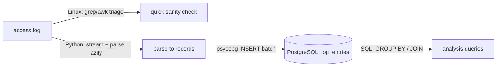

# Combined Exercise 01 — Log-to-Database Mini-Pipeline

| | |
|---|---|
| **Tracks** | 🐧 Linux + 🐍 Python + 🗄️ SQL |
| **Assumes** | Linux L1–3, Python L1–3, SQL L1–3 |
| **Estimated time** | ~2–3 hours |
| **Goal** | Turn raw web access logs into queryable data, using each tool for what it's best at |

---

## The scenario
You're handed a server's `access.log`. The team wants answers ("how many 500s per endpoint today?") that are painful to get from grep alone. You'll **triage with Linux text tools**, **parse and load with Python**, and **analyze with SQL** — the exact shape of a real ingestion task.

## What you'll build

## Steps

### Part A — Linux triage (warm-up, no code)
Using only shell pipelines (Linux L3):
1. Count total requests and how many returned `5xx`.
2. Top 10 IPs by request count.
3. Distinct URLs that ever returned `404`.

Record the pipelines and answers in `notes.md`. These become your **expected values** to validate the pipeline later.

### Part B — Python parser + loader (Python L1–3)
1. In a fresh `.venv` (Python L1), `pip install psycopg[binary]` and freeze requirements.
2. Write `load.py` that:
   - reads the log **lazily** line by line (Python L3 — never load the whole file);
   - parses each line into a record `(ip, ts, method, path, status, bytes)` using a regex (string handling; be careful with NULL/blank fields — Python L2 immutability/`None`);
   - **batches** inserts into PostgreSQL with a parameterized query (no string concatenation — SQL L2 security);
   - is idempotent: running twice shouldn't duplicate rows (use a natural key or truncate-then-load, your choice — justify it).
3. Handle malformed lines gracefully (count and skip; don't crash).

### Part C — SQL schema + analysis (SQL L1–3)
1. `schema.sql` creating `log_entries` with sensible types (`INET` for ip, `TIMESTAMPTZ` for ts, `SMALLINT` for status, etc.), `NOT NULL` where appropriate, and an index for your query patterns.
2. Write analysis queries that reproduce Part A's answers **in SQL** and go further:
   - requests and error-rate **per endpoint** (`GROUP BY path`);
   - top IPs (`GROUP BY ip ORDER BY count DESC`);
   - a `LEFT JOIN` against a small `endpoints(path, owner_team)` table so each path shows its owning team, including endpoints with zero traffic (SQL L3 outer join).

### Part D — Validate (all three)
Confirm the SQL answers **match** the Linux triage numbers from Part A. If they differ, find out why (parsing bug? skipped malformed lines? timezone?). This reconciliation is the real lesson.

## Acceptance criteria
- `load.py` runs in a clean venv from `requirements.txt`, streams the file (constant memory), and is safe to re-run.
- Row count in `log_entries` equals (total lines − malformed lines), and that matches your Linux `wc -l` minus skipped count.
- SQL "per-endpoint error count" and "top IPs" match the Linux pipeline results.
- The `LEFT JOIN` shows zero-traffic endpoints with `0`/NULL handled via `COALESCE`.
- A `README.md` documents setup + run commands end to end.

## Stretch goals
- Make `load.py` accept the log path and DB URL via CLI args / env (12-factor).
- Add a `--since` filter that only loads entries after a timestamp.
- Schedule it (preview Linux L15 cron / systemd timer) to ingest hourly.
- Compute a p95 response time in SQL (preview SQL L6 window functions) and compare to an `awk` estimate (Linux L3 stretch).

## Reflection (write a paragraph)
Which tool was best for which job, and why? When would you *not* hand-roll this and instead use an existing tool (Logstash/Fluent Bit/`COPY`)? This judgment — build vs. buy, right tool for the layer — is what interviewers and senior engineers care about.
