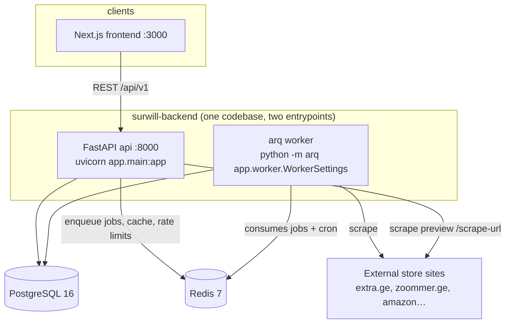

# Lesson 01 — Architecture & Project Layout

**Track:** FastAPI (Surwill) · **Time:** ~2h · **Prerequisites:** comfortable Python, basic HTTP
**Objectives:** hold the whole system in your head; explain why the code is organized the way it is; trace one request end to end.

---

## Why this matters

Interviewers rarely ask "what is a decorator" of a mid-level candidate. They ask
*"walk me through your project's architecture"* — and the quality of that answer
is set in the first ninety seconds. This lesson gives you the map: what runs,
where code lives, and the two or three deliberate decisions (modular monolith,
service layer, worker split) that you can defend under follow-up questions.

## Theory: the shape of a production FastAPI service

Most real FastAPI systems converge on the same three-way split:

1. **The API process** — stateless, horizontally scalable, does request/response
   work only. Anything slow or retryable is pushed out of it.
2. **A worker process** — same codebase, different entrypoint, consumes jobs from
   a queue (Redis here) and runs cron-style schedules.
3. **Stateful backing services** — PostgreSQL for durable data, Redis for
   ephemeral data (queues, caches, rate-limit counters).

Within the API codebase, the important axis is **vertical slicing by domain**
versus horizontal slicing by technical layer. A horizontally-sliced app has
`models/`, `schemas/`, `routes/` folders each containing every domain; it starts
easy and decays fast, because one feature change touches five folders. Surwill
slices vertically: each domain owns a package with its own `models.py`,
`schemas.py`, `routes.py`, `services.py`. This is the "modular monolith" — the
deploy unit is one app, but internally it's organized like a set of small
services that happen to share a process and a database. If one slice ever needs
independent scaling, its extraction path is already drawn.

The second axis is the **service layer**. Routes never contain business logic;
they parse/authorize (via dependencies), call one service function, and shape
the response. Services take plain arguments plus an `AsyncSession` and raise
domain exceptions. This is the pattern *Architecture Patterns with Python* calls
the service layer, and it is what makes the test suite possible: business rules
are tested by calling functions, not by simulating HTTP.

## Official documentation

> "FastAPI is a modern, fast (high-performance), web framework for building APIs
> with Python based on standard Python type hints."
> — FastAPI docs, https://fastapi.tiangolo.com/

FastAPI's own "Bigger Applications" guide (https://fastapi.tiangolo.com/tutorial/bigger-applications/)
shows the `APIRouter`-per-module pattern Surwill uses, though Surwill goes
further by making each module a full vertical slice.

## The system, drawn



Five containers in `docker-compose.yml`: `db`, `redis`, `api`, `worker`,
`frontend`. The API and worker are built from the **same image** — same code,
different command. That's a deliberate simplification: one build, one set of
dependencies, no drift between what the API and the worker think a model looks like.

## The code, explained: the layout

```
surwill-backend/
├── app/
│   ├── main.py            # FastAPI app: middleware, routers, health
│   ├── config.py          # pydantic-settings Settings + prod-secrets guard
│   ├── db.py              # async engine + session factory
│   ├── deps.py            # dependency-injection building blocks
│   ├── worker.py          # arq WorkerSettings: jobs + cron
│   ├── shared/            # cross-domain infrastructure
│   │   ├── models.py      #   Base + UUID/Timestamp/SoftDelete mixins
│   │   ├── security.py    #   bcrypt, JWT encode/decode, token hashing
│   │   ├── exceptions.py  #   domain exceptions as HTTPException subclasses
│   │   ├── permissions.py #   can_view_board() — central authorization
│   │   ├── email.py       #   SMTP transactional email
│   │   └── pagination.py
│   ├── auth/              # vertical slice: models, schemas, routes, services
│   ├── users/             # …same shape
│   ├── boards/            # wishlist boards
│   ├── items/             # items + THE SCRAPING SUBSYSTEM
│   │   ├── scraper.py     #   5-layer HTML extraction engine (~2600 lines)
│   │   └── scraping/      #   adapters, throttle, cache, security(SSRF), managed, normalizer
│   ├── reservations/      # gift reservations (SELECT FOR UPDATE atomicity)
│   ├── access/ connections/ notifications/ marquee/ featured/ admin/ landing/
├── alembic/               # migrations (env.py imports every model)
├── tests/                 # pytest: API tests, service tests, golden-file scraping tests
├── scripts/seed.py        # dev seed data
├── Dockerfile             # python:3.12-slim + Playwright Chromium
└── docker-compose.yml     # standalone backend stack
```

Three things to internalize:

**Every domain package has the same four files.** `models.py` (SQLAlchemy),
`schemas.py` (Pydantic DTOs), `routes.py` (thin HTTP layer), `services.py`
(business logic). Once you've read one slice you can navigate all twelve. The
uniformity *is* the documentation.

**`shared/` is infrastructure, not a junk drawer.** It contains only things
genuinely used by multiple domains — the SQLAlchemy base/mixins, security
primitives, the exception vocabulary, the central permission check. Notice what
is *not* there: no `utils.py`. Utility modules with vague names accrete garbage.

**`items/` is the heavyweight.** The scraping subsystem lives inside the items
slice because scraping exists solely to serve item creation. It's still
internally layered (`scraper.py` = pure extraction engine, `scraping/` =
operational concerns like rate limiting and SSRF defense, `services.py` =
orchestration). Lesson 10 dissects it.

## The code, explained: one request end to end

Take `POST /api/v1/boards/{board_id}/items` — adding an item to a board.

1. **uvicorn** accepts the connection, parses HTTP, hands an ASGI scope to Starlette/FastAPI (lesson 02).
2. **Middleware stack** runs (CORS → gzip → cache headers → security headers → request logging) — `app/main.py`.
3. **Routing** matches the path to `create_item` in `app/items/routes.py`:

```python
@router.post("/boards/{board_id}/items", response_model=ItemResponse, status_code=201,
             tags=["items"])
async def create_item(
    board_id: uuid.UUID,
    body: ItemCreate,
    current_user_id: CurrentUserID,
    db: DBSession,
) -> ItemResponse:
    item = await services.create_item(board_id, uuid.UUID(current_user_id), body, db)
    return ItemResponse.model_validate(item)
```

4. **Dependency injection** resolves `CurrentUserID` (validates the JWT from the
   `Authorization` header) and `DBSession` (opens an `AsyncSession`) *before* the
   function body runs (lesson 05).
5. **Pydantic** parses the JSON body into `ItemCreate`, rejecting bad payloads
   with an automatic 422 (lesson 04).
6. **The service** (`app/items/services.py`) loads the board, enforces ownership
   (`ForbiddenError` → 403 if you're not the owner), inserts the `Item`, commits.
7. **The response model** `ItemResponse.model_validate(item)` converts the ORM
   object to the public DTO — the route returns exactly the declared shape, and
   the OpenAPI schema at `/api/docs` documents it for free.

Six lines of route code, and every line delegates to a subsystem you'll study in
a dedicated lesson. That's the architecture working.

## How this is used in production

- **Startups** ship exactly this shape: modular monolith + one worker + managed
  Postgres/Redis, deployed on Railway/Render/Fly. It's the highest
  feature-velocity-per-ops-hour configuration known.
- **Enterprises** run the same code shape behind an API gateway, with the slices
  eventually extracted into services when team boundaries (not performance)
  demand it. Netflix and Uber both describe starting domains as monolith modules
  and extracting along ownership lines.
- **Scaling path:** API replicas scale horizontally (stateless — JWTs, no server
  sessions); the worker scales by running more consumers on the same Redis queue;
  Postgres scales up then out (read replicas); the scraper is the natural first
  extraction candidate because of its huge dependency (Chromium) — a fact this
  repo documents in `DEPLOY.md` as known deferred work.
- **Monitoring:** health endpoint pings DB+Redis (real readiness, orchestrators
  restart on 503), Sentry for exceptions, request-ID logging middleware for tracing.

## Advanced corner

**Why not microservices from day one?** Count the coordination costs the monolith
avoids: no inter-service auth, no distributed transactions (the reservation
invariant is one `SELECT FOR UPDATE` — try that across two services), no contract
versioning, one migration history. The senior-level answer is that service
boundaries should follow *team* boundaries (Conway), and a one-team product has
no interior boundary worth paying network costs for.

**Why not a shared "core" with abstract repositories?** Surwill's services take
`AsyncSession` directly instead of a repository interface. That's a trade-off:
repository ports (as in *Architecture Patterns with Python*) buy testability
without a DB and storage swapability, at the cost of a layer of indirection.
Surwill's tests use a real Postgres instead — arguably the stronger test, and the
indirection is deferred until a second storage backend actually exists. Be ready
to argue both sides.

**Import-time coupling is the monolith's hidden failure mode.** `app/worker.py`
imports *every* model module up front with a comment explaining why: SQLAlchemy
resolves string-named relationships (`Board → "User"`) against a registry, and a
worker job that imports only `Item` would crash with `InvalidRequestError`. In a
sliced monolith the ORM registry is the one place all slices still touch.

## Best practices (visible in this codebase)

- One vertical slice per domain; identical internal shape per slice.
- Routes thin, services thick; services raise domain exceptions, routes never `try/except`.
- Same image for API and worker — kills dependency drift.
- Infrastructure in `shared/`, named by what it is (`security.py`, `permissions.py`), never `utils.py`.
- The comment style: comments record *constraints and reasons* ("SPA stores get
  nothing from a plain fetch — go straight to Playwright"), not narration.

## Common mistakes & gotchas

- **Fat routes.** The moment a route has an `if` that isn't authorization, logic
  has leaked out of the service layer and out of reach of unit tests.
- **Cross-slice imports of internals.** Slices should touch each other through
  services (`from app.boards.services import get_or_create_default_board`), not
  reach into each other's queries. Surwill does this correctly — copy it.
- **Circular imports** are the tax on vertical slicing; Surwill breaks cycles
  with function-local imports (see `_attach_gift_totals_and_partner` importing
  `MarqueePartner` inside the function). Know why before an interviewer asks.

## Where AI helps (and hurts)

AI is excellent at generating a new slice from an existing one ("make
`favorites/` shaped like `boards/`") because the pattern is mechanical. It is
dangerous for architecture decisions — it will happily generate the microservice
split you ask for without telling you that you don't need it. Use it as a
pattern-stamper, not an architect.

## Learn independently

- **Architecture Patterns with Python** (Percival & Gregory) — ch. 1–4 (repository,
  service layer), ch. 13 (dependency injection & bootstrapping). Free at
  https://www.cosmicpython.com/. This book *is* this lesson, generalized.
- **Fluent Python, 2nd ed.** (Ramalho) — ch. 21 "Async" for the concurrency model
  under all of this.
- FastAPI "Bigger Applications": https://fastapi.tiangolo.com/tutorial/bigger-applications/
- *Designing Data-Intensive Applications* (Kleppmann) — ch. 1 for the vocabulary
  of reliability/scalability you'll want in the interview.

## Interview Q&A

**Q: Walk me through your project's architecture.**
A (model answer, ~60s): "It's a modular monolith: one FastAPI codebase with two
entrypoints — the API process and an arq background worker — over Postgres and
Redis. The code is sliced vertically: each domain (auth, boards, items,
reservations…) owns its models, schemas, routes, and services, and routes are
deliberately thin — they authenticate via dependencies, call one service
function, and serialize the response. Redis does three jobs: the task queue,
scrape caching, and rate-limit counters. The worker handles everything slow or
scheduled — sending emails, scraping product pages hourly, archiving bought
items. The interesting subsystems are the scraping pipeline, which has five
escalating fetch strategies, and the reservation flow, which uses row locking to
guarantee an item can't be double-reserved."

**Q: Why a monolith and not microservices?**
A: "One team, one product, one database — a service split would buy network
latency, distributed-transaction pain, and contract versioning, and pay for
nothing. The vertical slicing means extraction is cheap later; the first
candidate is the scraper, because it drags a headless Chromium into the image.
Boundaries should follow team ownership, and we had one team."

**Q: What happens if two users reserve the same gift simultaneously?** *(lead-in
to lesson 06/13)* A: "The reservation service locks the item row with `SELECT …
FOR UPDATE`; the second transaction blocks until the first commits, then sees
`status != 'available'` and gets a 409. The invariant is enforced by the
database, not by application-level checks that race."

## Exercises against the codebase

- **Easy:** Trace `POST /api/v1/auth/login` the same way lesson traced item
  creation — write down every file it touches, in order.
- **Medium:** Add a new vertical slice `tags/` (model, schema, route, service)
  that lets a user attach tags to items. Follow the existing shape exactly.
- **Hard:** Draw the import graph between slices (`grep -r "from app\." app/`).
  Find every cross-slice import; classify each as "via services (fine)" or
  "reaching into internals (smell)".

## Key takeaways

- Surwill = modular monolith, vertically sliced, service layer, one image/two entrypoints.
- Routes parse+authorize+delegate; services own logic; shared/ owns infrastructure.
- Redis is queue + cache + rate limiter; Postgres owns all durable state.
- Know the extraction story (scraper first) and the monolith defense cold.
