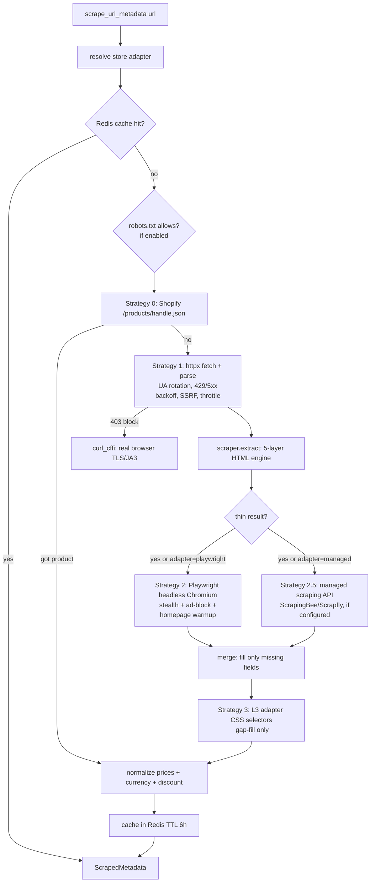

# Lesson 10 — DEEP DIVE: The Scraping Subsystem

**Track:** FastAPI (Surwill) · **Time:** ~3.5h · **Prerequisites:** lessons 06, 09
**Objectives:** understand the whole pipeline — the five-strategy fetch escalation, the layered HTML extractor, SSRF defense, rate limiting, caching, currency normalization, and the store-adapter registry — well enough to whiteboard it and defend every design decision.

---

## Why this matters

This is the most complex subsystem in Surwill and the one that makes the best
interview centerpiece: it touches networking, security (SSRF), anti-bot
tactics, resilience, caching, internationalization, and a genuinely hard
extraction problem (every store's HTML is different). It's also where you can
demonstrate *taste* — knowing when to escalate to an expensive tool and when to
stop, when to obey robots.txt, when to reach for a paid API. Take this slowly
with the code open.

## The problem

A user pastes `https://zoommer.ge/…/xiaomi-tv-…-p50792` and expects a titled,
priced, imaged item to appear. To deliver that, the system must fetch a page it
doesn't control and extract structured product data from unstructured HTML —
across Shopify stores, Next.js SPAs, Vue SPAs, WooCommerce, and a dozen
bespoke Georgian shops, some behind Cloudflare, some with broken TLS, some
rendering entirely in JavaScript. There is no single technique that works
everywhere, so the design is a **cascade of escalating strategies, cheapest
first**, each expensive one attempted only when the cheaper ones came up thin.

## Architecture at a glance



Everything is wired in `scrape_url_metadata` (`app/items/services.py`); the
extraction engine is `app/items/scraper.py` (~2600 lines); the operational
concerns live in `app/items/scraping/` (adapters, security, throttle, cache,
managed, normalizer).

## Part 1 — The fetch escalation (services.py)

### Strategy 0: the Shopify shortcut

```python
async def _try_shopify_product_json(url: str) -> dict | None:
    # …extract /products/{handle} from the path…
    json_url = f"{parsed.scheme}://{parsed.netloc}/products/{handle}.json"
    # GET it; non-Shopify sites 404 instantly (cheap probe)
```

Shopify exposes a clean JSON document at `/products/{handle}.json`. If the URL
looks like a product path, one cheap request either returns *perfect
structured data* (no HTML parsing, no guessing) or 404s immediately. **Always
try the free, reliable path before the expensive, fuzzy one** — the design
principle of the whole cascade, stated in its first strategy.

### Strategy 1: polite, disguised, defended HTTP (`_fetch_html`)

The workhorse. One function braids together five concerns:

```python
async def _fetch_html(url: str, timeout: int = 15) -> tuple[str, str]:
    await assert_safe_url(url)                    # SSRF gate (Part 3)
    for attempt in range(3):
        if attempt > 0:
            await asyncio.sleep(1.5 ** attempt)   # exponential backoff
        headers = _make_headers(url, referer=...) # rotated UA + realistic headers
        await throttle.throttle_domain(url, settings.SCRAPER_RATE_PER_SECOND)  # politeness
        resp = await _guarded_get(url, headers, timeout)   # per-hop SSRF on redirects
        if resp.status_code == 429:
            wait = min(int(resp.headers.get("Retry-After", "5")), 15)
            await asyncio.sleep(wait); continue
        if resp.status_code == 403:               # anti-bot → escalate
            html = await _fetch_curl_cffi(url, timeout=max(timeout, 20))
            if html is not None: return html, url
        if resp.status_code in _RETRYABLE_STATUS and attempt < 2:
            continue                              # 429/500/502/503/504 retry
        resp.raise_for_status()
        return resp.text, str(resp.url)
```

- **UA rotation + realistic headers** (`_make_headers`): seven real browser
  User-Agents, plus `Sec-Fetch-*`, `Accept-Language: …,ka;q=0.8`, referer on
  retries. Many stores 403 obvious bots; looking like a browser is the price of
  entry. (This is grey-hat but standard; see the ethics note.)
- **Exponential backoff** on retries (`1.5**attempt`), and **`Retry-After`
  respect** on 429 — good citizenship *and* effectiveness.
- **`_client_get` TLS fallback**: some Georgian stores ship broken certs; on a
  TLS `ConnectError` it retries once with `verify=False` (logged). Verification
  on by default, degraded deliberately and visibly — not blanket-disabled.
- **403 → curl_cffi escalation** (see below).

### The 403 escalation: `curl_cffi`

```python
async def _fetch_curl_cffi(url: str, timeout: int = 20) -> str | None:
    from curl_cffi.requests import AsyncSession
    await assert_safe_url(url)
    async with AsyncSession() as session:
        resp = await session.get(url, impersonate="chrome", headers=_make_headers(url), timeout=timeout)
        if resp.status_code == 200:
            return resp.text
```

A 403 is usually not "you're unauthorized" — it's Cloudflare fingerprinting
your **TLS handshake** (JA3) and seeing "Python/httpx", not a browser. `httpx`
can't fake the handshake; `curl_cffi` binds to curl-impersonate and reproduces
Chrome's exact TLS/JA3 signature. This defeats most 403 walls **without** a
headless browser — a cheap rung between plain HTTP and Playwright. Knowing
*why a 403 happens at the TLS layer* is a standout interview detail.

### Strategy 2: Playwright headless Chromium (`_fetch_with_playwright`)

For client-rendered SPAs (Vue/React with no server-side HTML) a fetch returns
an empty shell — the product exists only after JS runs. Playwright drives real
Chromium:

- **Forced for known SPAs** (`adapter.fetcher == "playwright"`, e.g.
  `reckless.ge`) so it skips the pointless plain fetch; otherwise triggered only
  when the result is *thin* (`_is_thin_result`: no title, or no image and no
  price).
- **Stealth init script** patches automation tells (`navigator.webdriver`,
  plugins, languages, `window.chrome`) before any navigation — headless Chromium
  is detectable by default.
- **Ad/analytics route-blocking** (`_PW_BLOCK_RE` aborts googletagmanager,
  facebook, hotjar, …) — speeds load and avoids breaking on tracker JS.
- **Homepage warmup** — visits `/` first to collect cookies and look like a real
  session before hitting the product URL.
- **`networkidle` with a `domcontentloaded` fallback** — some pages poll
  forever and never reach networkidle; the fallback prevents a hang.

This is powerful and *expensive* — a whole browser, ~hundreds of MB RAM, seconds
per page. It's why Playwright's Chromium is baked into the image and why the
image is huge (lesson 12 / DEPLOY.md flag it as the first thing to split out).

### Strategy 2.5: the managed API (`scraping/managed.py`)

The last 5–10% (aggressive Cloudflare/PerimeterX, CAPTCHAs, foreign
marketplaces) beat even Playwright-from-your-IP. A managed scraping API
(ScrapingBee/Scrapfly) fetches from residential IPs with CAPTCHA handling.

```python
async def fetch_via_managed(url: str) -> str | None:
    provider = settings.MANAGED_SCRAPER_PROVIDER
    key = settings.MANAGED_SCRAPER_API_KEY
    if not provider or not key:
        return None                    # disabled by default → costs nothing
    ...
    await assert_safe_url(url)          # SSRF-checked even through a paid proxy
```

Design notes: **disabled unless configured** (no surprise bills), **provider-
agnostic** (`_build_request`/`_extract_html` are pure functions — trivially
unit-tested with no network, and lesson 11 shows those tests), and the explicit
policy "**we never build CAPTCHA solving ourselves**". Foreign marketplaces are
routed here by the adapter (`amazon.com → fetcher="managed"`), with the
codebase's own comment preferring official APIs (Amazon PA-API) + ToS sign-off.

### Merging: fill only the gaps

Every strategy after the first *supplements*, never clobbers:

```python
for key in _MERGE_KEYS:
    if not data.get(key) and pw_data.get(key):
        data[key] = pw_data[key]
```

Confidence/provenance is then stamped (`extracted_via`: shopify-json →
structured-data → managed/playwright → adapter) so downstream code (and
debugging) knows how the data was obtained. Cheapest, most-trusted source wins;
expensive sources only fill holes.

## Part 2 — The extraction engine (scraper.py)

`scraper.extract(url, html)` turns one HTML string into a product dict via
**layered fallback**, best source first:

```python
platform = (_from_shopify(soup).merge(_from_woocommerce(soup))
            .merge(_from_nextjs(soup)).merge(_from_angular_transfer(soup))
            .merge(_from_datalayer(soup)).merge(_from_window_data(soup)))
merged = platform.merge(_from_jsonld(soup)).merge(_from_meta(soup)).merge(_from_microdata(soup))
# then HTML heuristics fill anything still missing: sizes, colors, stock, specs,
# category, prices, brand, images…
```

The precedence ladder, and *why* it's ordered so:

0. **Platform JSON** (Shopify `ProductJson`, Next.js `__NEXT_DATA__`/Apollo,
   Angular transfer-state, GTM `dataLayer`, WooCommerce, `window.*`) — the
   store's own machine data; most complete and reliable when present.
1. **JSON-LD** (`schema.org/Product`) — standardized, SEO-motivated so widely
   present, high quality.
2. **Open Graph / Twitter meta** — title/image/price meant for social cards;
   nearly universal, shallow.
3. **Microdata** (`itemprop`) — older schema.org-in-HTML.
4. **HTML heuristics** — the last resort: scored `` selection, price regex
   with currency detection, size/color/spec scraping. Fragile, so it's *lowest*
   priority and only fills gaps.

The `_Product.merge(other)` method encodes "self wins, other fills blanks",
which is how the ladder composes cleanly.

Depth worth calling out (all real, all in the file):

- **Image scoring** (`_scored_image_candidates`): scores every `` by
  gallery vs "related products" context, explicit dimensions, full-size vs
  thumbnail keywords, extension — because "the product photo" is a ranking
  problem, not a selector.
- **Georgian-language patterns**: `მარაგშია` (in stock) / `არ არის მარაგში`
  (out of stock), size/price nouns, `previousPrice`/`discountPercent` keys used
  by local platforms — the extractor is localized, not just translated.
- **Variants**: per size/color combos with their own price/stock (Shopify
  variants, disabled size buttons in HTML), and stock inferred from
  `any(variant.in_stock)` when the page has no top-level flag.
- **Sale-price sanity**: an `original_price` that isn't strictly above `price`
  is dropped (carries no information); a consistent HTML sale pair can override
  a stale structured pre-sale price.

You do **not** need to memorize 2600 lines. You need the *shape*: layered
fallback, best-source-first, `merge` semantics, heuristics as last resort. That
shape is the interview answer.

## Part 3 — Operational concerns (scraping/ package)

### SSRF defense (`security.py`) — the security centerpiece

User-supplied URLs are an **SSRF** vector: paste
`http://169.254.169.254/latest/meta-data/` and a naive scraper fetches your
cloud provider's credential endpoint and hands you the secrets. `assert_safe_url`:

```python
async def assert_safe_url(url: str) -> None:
    if parsed.scheme.lower() not in {"http", "https"}:   # no file://, gopher://…
        raise UnsafeURLError(...)
    # literal IP? check directly. hostname? resolve EVERY address it maps to:
    for info in await loop.getaddrinfo(host, None, ...):
        if _ip_is_blocked(ip):        # private / loopback / link-local / reserved / multicast
            raise UnsafeURLError(...)
```

The subtleties that make it *correct*, not theater:

- **Blocks by resolved IP, not string** — `http://my-evil-domain.com` that
  resolves to `10.0.0.5` is caught (DNS-rebinding-aware at fetch time).
- **`is_link_local` covers `169.254.0.0/16`** — the cloud metadata endpoint.
- **Re-checked on every redirect hop** (`_guarded_get` follows redirects
  manually and calls `assert_safe_url` each time) — because a public URL can
  302 to an internal one. This is the mistake most homegrown SSRF guards make.
- **Enforced even in the managed-API path** — a paid proxy mustn't become an
  SSRF bypass.

This is the single highest-value thing to be able to explain in a security-
minded interview. (Residual gap to mention for honesty: TOCTOU between the
resolve and the actual connect; the redirect-hop re-check narrows it, a
pinned-IP connection would close it.)

### Rate limiting & robots (`throttle.py`)

```python
async def throttle_domain(url, rate_per_second):
    # Redis 1-second window counter keyed by host, shared across API + worker.
    key = f"scrape:rate:{host}:{int(time.time())}"
    count = await redis.incr(key)
    if count == 1: await redis.expire(key, 2)
    if count > rate_per_second: await asyncio.sleep(1.0)
```

Per-domain throttle **shared across processes via Redis** — so the hourly
worker refresh and live user previews can't collectively hammer one store.
`robots_allows` fetches+caches robots.txt (24h) and **fails open** (allows on
any error) — a config choice (`SCRAPER_RESPECT_ROBOTS`, off by default) with
real ethical/legal weight, discussed below. Everything here is **best-effort**:
if Redis is down, throttling degrades to a no-op rather than breaking scrapes —
availability over perfect politeness, stated in the module docstring.

### Caching (`cache.py`)

SHA-256(url) → Redis key, 6-hour TTL, JSON value. A product's metadata rarely
changes within hours, so the *add-item preview* path caches aggressively —
repeat previews are instant, and it's the cheapest politeness win (fewer store
hits). Crucially, the **availability/refresh path deliberately does NOT use the
cache** — its entire job is freshness (current price/stock), so caching there
would defeat the purpose. Knowing *which* path caches and why is the nuance.

### Currency normalization (`normalizer.py`)

Scraped prices are chaos: `"833.67 ₾"`, `"1 899₾"`, `"₾2,699"`, `"$1,049.00"`,
`"1.234,56 €"`. `parse_price` wraps the `price-parser` library, maps 15+
symbols/loose codes to ISO-4217 (`₾→GEL`, `$→USD`, `₺→TRY`, Georgian `ლ→GEL`),
falls back to the store adapter's `currency_default`, and computes
`discount_pct` from price vs original. Non-destructive: a field that won't parse
is left untouched so a partial scrape never degrades.

### The store adapter registry (`adapters.py`)

```python
@dataclass(frozen=True)
class StoreAdapter:
    domain: str
    fetcher: str = "httpx"            # "httpx" | "playwright" | "managed"
    currency_default: str = "GEL"     # Georgian-first
    selectors: dict[str, str] = ...   # L3 CSS gap-fillers, added only when a test proves a miss
```

The registry maps domains to overrides. Its **design philosophy is the lesson**:
most stores need *no* adapter — the generic engine handles them; adapters exist
only to (a) set a currency default, (b) force a tougher fetcher for known SPAs
(`reckless.ge → playwright`) or marketplaces (`amazon.* → managed`), or (c)
supply CSS selectors as a *last-resort* gap-filler **"never speculatively"**
(the code comment) — you add a selector only when a golden test (lesson 11)
shows the engine missed a field. `resolve()` does exact-host → registered-suffix
→ generic-fallback matching, so an unknown store still works. This is
open/closed done right: extend by registering, don't edit the engine.

## How this is used in production

Price-comparison, aggregators, and monitoring products (Honey, Keepa,
PriceRunner, and countless retail-intelligence startups) run exactly this
escalation-cascade shape. The industry norms Surwill mirrors: try official/
structured data first (product feeds, JSON-LD, Shopify JSON), escalate to
rendering only when needed (cost), buy the hardest fetches from managed
providers rather than maintaining a proxy/CAPTCHA farm, and centralize
politeness (rate limits, robots, caching). The parts Surwill *correctly leaves
as commentary* — "prefer Amazon PA-API and get ToS sign-off before scraping" —
are exactly the compliance conversations real teams have; being able to raise
them signals you understand scraping is as much legal/ethical as technical.

## Advanced corner

- **The ethics/legality layer.** Scraping public pages is broadly legal in the
  US post-*hiQ v. LinkedIn*, but ToS violations, rate abuse, and copyrighted-
  data reuse carry real risk; robots.txt is a norm, not a law. Surwill's
  `SCRAPER_RESPECT_ROBOTS` flag (default off) and "prefer official APIs" comments
  are the codebase acknowledging this. The mature interview stance: "technically
  we *can* fingerprint-spoof past most walls; whether we *should* depends on
  ToS, jurisdiction, and whether an API exists — I default to the API."
- **Cost gradient as architecture.** The five strategies are literally ordered
  by cost: a 404-probe (free) → one HTTP GET (cheap) → curl_cffi (cheap) →
  headless Chromium (expensive: RAM/CPU/seconds) → paid API (real money). The
  whole design is "spend the least that works." That framing impresses.
- **Anti-bot is an arms race.** JA3 spoofing (curl_cffi) and stealth scripts
  work *today*; Cloudflare ships new signals constantly. A production scraper is
  maintenance, not build-once — which is the argument for outsourcing the hard
  tail to a managed provider whose *job* is keeping up.
- **Extraction is fuzzy; test it deterministically.** The engine's correctness
  can't be unit-reasoned across 2600 lines — it's pinned by golden-file tests
  against saved real HTML (lesson 11). That pairing (fuzzy code + golden tests)
  is the only sane way to maintain a scraper.
- **Playwright is the extraction cost you can't hide.** It dominates the image
  size and the per-scrape latency; the natural evolution is a separate
  scraper-worker service so the API image stays slim (DEPLOY.md's first
  deferred item).

## Best practices (embodied here)

- Cheapest reliable strategy first; escalate only on thin results; expensive
  tools behind flags/adapters.
- Never overwrite good data — later strategies fill gaps only; stamp provenance.
- SSRF-check every user URL, on every redirect, in every fetch path.
- Centralize politeness (rate limit + cache + robots) across API and worker via Redis.
- Extend via the adapter registry; add selectors only when a golden test proves a gap.
- Everything Redis-backed degrades to a safe no-op when Redis is down.

## Common mistakes & gotchas

- **SSRF via redirect** — checking the initial URL but following redirects
  blindly. Surwill re-checks each hop; most tutorials don't.
- Overwriting structured data with flaky heuristics (get the merge direction wrong).
- Caching the *availability* path and shipping stale prices.
- One giant regex/selector per site → unmaintainable; layered fallback + tiny
  per-site adapters scale.
- Blocking the event loop with a sync HTTP or parse call inside the async worker (lesson 09).
- Treating scraping as build-once; it's continuous maintenance.

## Where AI helps (and hurts)

AI is great for *writing new extractors* ("parse this store's `__NEXT_DATA__`
shape") and for generating adapter selectors from a pasted HTML sample. It is
dangerous on **SSRF** (it'll write the naive initial-URL-only check), on
**merge precedence** (clobbering vs gap-fill), and it has no opinion on the
ethics/ToS layer. Use it to draft a layer; you own the security and the policy.

## Learn independently

- OWASP SSRF Prevention Cheat Sheet:
  https://cheatsheetseries.owasp.org/cheatsheets/Server_Side_Request_Forgery_Prevention_Cheat_Sheet.html
- schema.org/Product + Open Graph protocol (ogp.me) — the structured-data your extractor mines.
- Playwright Python docs (network interception, `add_init_script`):
  https://playwright.dev/python/
- `curl_cffi` / curl-impersonate READMEs — the JA3/TLS-fingerprint story.
- **Web Scraping with Python** (Mitchell, O'Reilly) — the survey text; pair with the OWASP sheet for the security half.

## Interview Q&A

**Q: Walk me through what happens when a user adds an item by URL.**
A: "We resolve a store adapter, check a 6-hour Redis cache, then run a cost-
ordered cascade. Strategy 0 probes Shopify's `/products/handle.json` — free and
perfect when it hits. Otherwise an httpx GET with rotated browser headers, SSRF
validation, per-domain throttling, and 429/5xx backoff; a 403 escalates to
curl_cffi, which reproduces Chrome's TLS fingerprint to beat Cloudflare. The
HTML goes through a five-layer extractor — platform JSON, JSON-LD, Open Graph,
microdata, then HTML heuristics — best source first. If the result is still
thin, or the store is a known SPA, we render it in headless Chromium with
stealth patches; the last resort for the hardest sites is a managed scraping
API, disabled unless configured. Each stage only fills missing fields, we stamp
how the data was obtained, normalize the price and currency, cache it, and
return."

**Q: A user pastes `http://169.254.169.254/…`. What stops it?**
A: "`assert_safe_url` — it rejects non-http(s) schemes and resolves the host,
blocking any address that's private, loopback, link-local (which is exactly the
169.254 cloud-metadata range), reserved, or multicast. It blocks by *resolved*
IP so a domain pointing at an internal address is caught, and it re-runs on
every redirect hop because a public URL can redirect inward. It even runs
before the managed-API call so a paid proxy can't be an SSRF bypass. The
residual risk is TOCTOU between resolve and connect, which pinning the resolved
IP for the actual request would close."

**Q: Why five strategies instead of just using Playwright for everything?**
A: "Cost. Playwright is a whole browser — hundreds of MB and seconds per page —
so using it for a Shopify store that hands you clean JSON in one request is
wasteful. The strategies are ordered cheapest-first: a free 404-probe, a normal
HTTP GET, a TLS-fingerprint retry, then the browser, then a paid API. We spend
the least that works, escalating only when the cheaper result is thin. It's
also why splitting Playwright into its own worker is our first infra
optimization — it dominates the image size."

**Q: How do you add support for a new store that the engine gets wrong?**
A: "Save its real HTML as a fixture, write a golden test asserting the fields we
want, and watch it fail. If it's a rendering issue, register the domain with
`fetcher='playwright'`; if the generic engine just misses one field, add a CSS
selector to that domain's adapter — never speculatively, only because the test
proved the gap. The generic engine stays untouched; I extend by registration.
That's open/closed, and the golden test locks the behavior so a future engine
change can't silently regress that store."

**Q: Is this legal/ethical?**
A: "Scraping public data is broadly permissible but ToS, rate abuse, and
data-reuse carry real risk, and robots.txt is a norm not a law. So the codebase
has a robots-respect flag, centralized rate limiting, and comments preferring
official APIs like Amazon PA-API with ToS sign-off for marketplaces. My default
is: use the API if one exists, scrape politely if not, and don't build CAPTCHA
evasion — outsource the hard tail to a provider who owns that responsibility."

## Exercises against the codebase

- **Easy:** Run the golden tests (`pytest tests/test_scraping_golden.py -v`) and
  match each assertion to the strategy/layer that produced it (Shopify JSON vs
  Next.js platform JSON vs HTML heuristics).
- **Medium:** Add a fixture + golden test for a new (real) store page; if it
  fails, decide between a fetcher override and a selector, implement the minimal
  fix, make it green.
- **Hard:** Write a failing test proving the SSRF redirect gap would exist
  *without* per-hop checking (mock a public URL 302-ing to `127.0.0.1`), then
  confirm `_guarded_get`'s per-hop `assert_safe_url` catches it. Bonus: sketch
  the pinned-IP connection that would also close the TOCTOU window.

## Key takeaways

- The pipeline is a **cost-ordered escalation cascade**: Shopify-JSON → httpx →
  curl_cffi(JA3) → Playwright → managed API, each filling only the gaps.
- The extractor is **layered best-source-first** fallback (platform JSON →
  JSON-LD → OG → microdata → HTML heuristics) with `merge` = self-wins.
- **SSRF defense** validates by resolved IP, blocks link-local metadata, and
  re-checks every redirect hop and every fetch path — the security centerpiece.
- Politeness (per-domain Redis throttle, robots, 6h cache) is centralized and
  degrades safely; currency normalization tames real-world price chaos.
- Extend via the **adapter registry**, add selectors only when a **golden test**
  proves a gap — fuzzy engine, deterministic tests.
